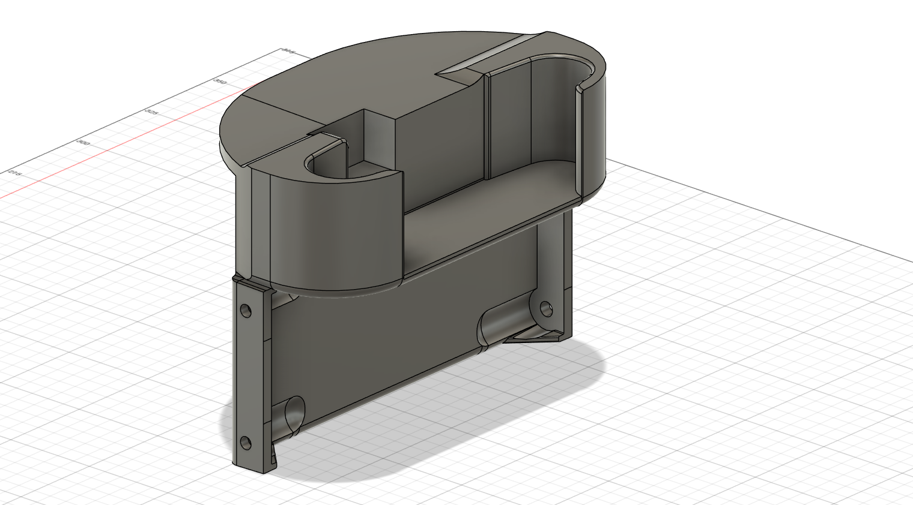
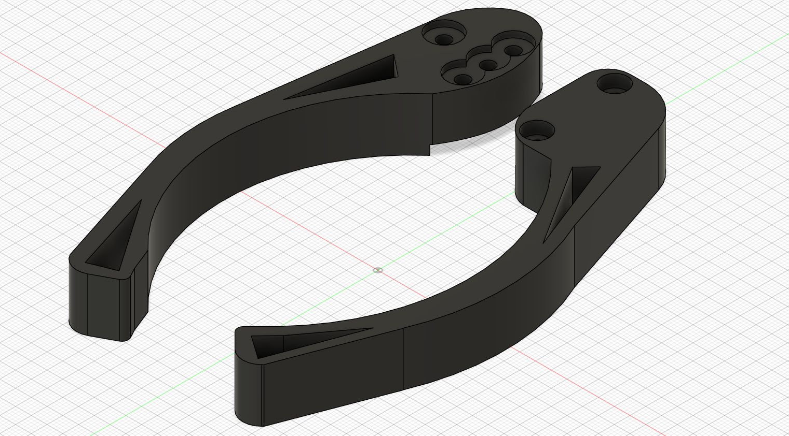
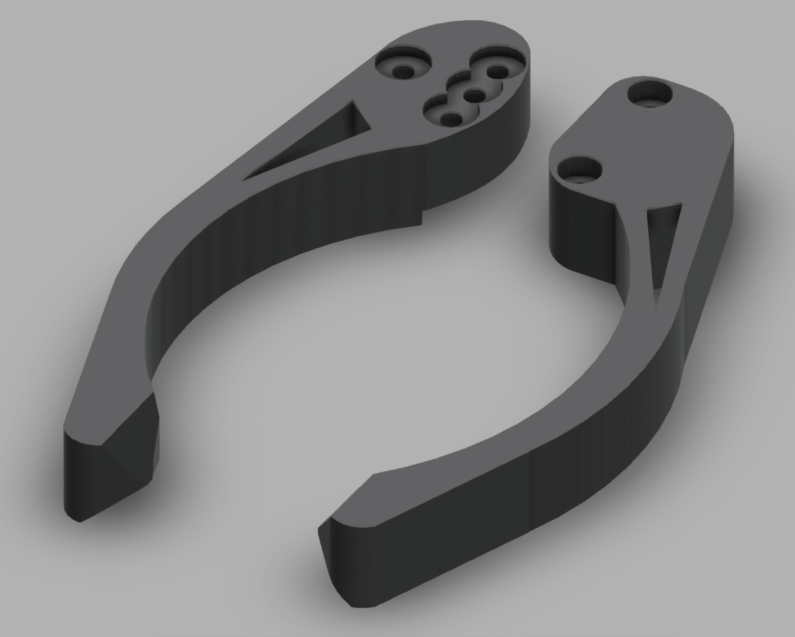

# 3D Designs
We have several free, no-liscence prints that may be useful for your robotics project!

### [Our Camera Mount For Logitech C920; designed to work on a *REV* Frame](https://a360.co/40rqsrF)

### [Our Currect Claw; Designed to Work on a *REV* Servo](https://newlifeacademy66.autodesk360.com/g/shares/SH30dd5QT870c25f12fca573175cac387ed0)

### [A Pulley Wheel That Could Be Used For the Linear Slide on Your Robot!](https://newlifeacademy66.autodesk360.com/g/shares/SH30dd5QT870c25f12fcbb72162f64ea236b)

### [A Pulley Wheel Used For the Linear Slide on our Robot](https://newlifeacademy66.autodesk360.com/g/shares/SH30dd5QT870c25f12fc56a712a01d85d836)
(This is a design that is specialized for our robot, but it might not be as good for your robot as the other wheel.

### [Our Possible Future Claw; Designed to Work on a *REV* Servo](https://newlifeacademy66.autodesk360.com/g/shares/SH30dd5QT870c25f12fc6f635a2227be594f)

