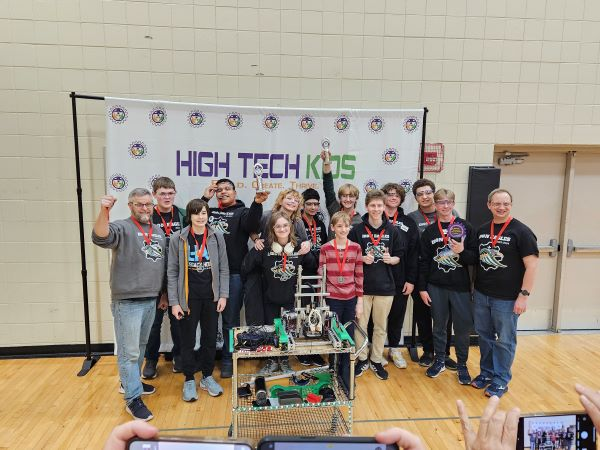

# The FIRST Tech Challenge Teams of New Life Academy, Woodbury MN 
## Team 17240 - Iron Eagles
## Team 32014 - Wings of Steel

## About Us
We strive to foster growth and learning in a fun, competitive environment.

*Team Photo from [MN FTC Qualifier - Maple Grove, Saturday Dec 7th 2024](https://ftc-events.firstinspires.org/2024/USMNMGQ1)*

## Video
- New Life Academy Robotics Promotional Video on [YouTube](https://www.youtube.com/watch?v=FmHC0kmDVho)
- [Team YouTube Page](https://www.youtube.com/@TheIronEagles)

## 3d Printed Parts
[Access our *free* print files here.](designs/3ddesigns.md)

## Events
### 2025-2026 : Decode
- [2025 MN Qualifier 2 - January 17 2026 Prarie View Middle School](matchpages/matchpage-unmnotq1-2025.md)
- [2025 MN Qualifier 1 - December 6 2025 Maple Grove High School](matchpages\matchpage-unmnmgq1-2025)

### 2024-2025 : Into the Deep
- [2024 MN Qualifier 2 - Jan 11 2025 Burnsville High School](matchpages\matchpage-usmnbuq1-2024)
- [2024 MN State - Feb 15 Burnsville High School](matchpages\matchpage-usmncnp-2024)

## Links
- [Team 17240 Page on FTC Events](https://ftc-events.firstinspires.org/team/17240)
- [Team 32014 Page on FTC Events](https://ftc-events.firstinspires.org/team/32014)
- [Instagram](https://www.instagram.com/ironeagles17240/)
